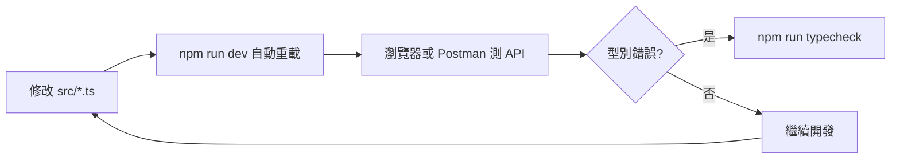

# Node.js + Express + TypeScript + tsx 環境設定教學

本教學說明如何在 Windows 上，為 **RebalanceAlert** 專案建立可運行的後端開發環境。完成後你可以：

- 用 `tsx` 在開發時熱重載執行 TypeScript
- 用 `tsc` 編譯成 JavaScript 後正式部署
- 透過 Express 提供 REST API

> 相關文件：[PRD](./gemini-code-1780632844359.md) · [技術規格](./technical-spec-express-typescript.md)

---

## 1. 前置需求

### 1.1 安裝 Node.js

1. 前往 [https://nodejs.org](https://nodejs.org) 下載 **LTS 版本**（建議 v20 或 v22）。
2. 安裝時勾選「Add to PATH」。
3. 開啟 **PowerShell** 或 **終端機**，確認版本：

```powershell
node -v
npm -v
```

預期輸出類似：

```
v22.x.x
10.x.x
```

### 1.2 建議安裝的工具（選用）

| 工具 | 用途 |
| :--- | :--- |
| [Git](https://git-scm.com/) | 版本控制 |
| [VS Code](https://code.visualstudio.com/) 或 Cursor | 編輯器 |

---

## 2. 專案取得與進入目錄

```powershell
cd D:\webPorject\RebalanceAlert
```

---

## 3. 建立 `package.json`（若專案還沒有）

`npm install` **必須**先有 `package.json`，否則無法安裝套件。

### 3.1 檢查是否已有 `package.json`

```powershell
Test-Path package.json
```

- 顯示 `True` → 已有，直接跳到 [§4 安裝相依套件](#4-安裝相依套件)
- 顯示 `False` → 繼續下面的步驟

### 3.2 方法一：直接建立檔案（推薦）

在專案根目錄建立 `package.json`，內容如下：

```json
{
  "name": "rebalance-alert",
  "version": "0.1.0",
  "description": "0050 + 00631L 投資組合動態槓桿計算器",
  "main": "dist/server.js",
  "scripts": {
    "dev": "tsx watch src/server.ts",
    "build": "tsc",
    "start": "node dist/server.js",
    "typecheck": "tsc --noEmit"
  },
  "keywords": [],
  "license": "ISC",
  "dependencies": {
    "express": "^4.21.2"
  },
  "devDependencies": {
    "@types/express": "^4.17.21",
    "@types/node": "^22.13.10",
    "tsx": "^4.19.3",
    "typescript": "^5.8.2"
  }
}
```

同時也需要 `tsconfig.json`（見 [§5.2](#52-tsconfigjson--typescript-編譯設定)）與 `src/app.ts`、`src/server.ts`（見 [§7](#7-最小可運行專案結構)）。

### 3.3 方法二：用 npm 指令互動建立

若你想從完全空白開始：

```powershell
npm init -y
```

這會產生一個最精簡的 `package.json`，接著**手動安裝**所需套件：

```powershell
npm install express
npm install -D typescript tsx @types/express @types/node
```

然後手動編輯 `package.json`，在 `"scripts"` 區塊加入：

```json
"scripts": {
  "dev": "tsx watch src/server.ts",
  "build": "tsc",
  "start": "node dist/server.js",
  "typecheck": "tsc --noEmit"
}
```

> **兩種方法的差異：** 方法一一次到位；方法二適合想理解每個套件怎麼裝的人。最終結果相同。

---

## 4. 安裝相依套件

確認根目錄已有 `package.json` 後，執行：

```powershell
npm install
```

這會依照 `package.json` 安裝：

| 類型 | 套件 | 用途 |
| :--- | :--- | :--- |
| 正式依賴 | `express` | Web 框架 |
| 開發依賴 | `typescript` | TypeScript 編譯器 |
| 開發依賴 | `tsx` | 直接執行 `.ts` 並支援熱重載 |
| 開發依賴 | `@types/express` | Express 型別定義 |
| 開發依賴 | `@types/node` | Node.js 型別定義 |

安裝完成後會產生 `node_modules/`（已在 `.gitignore` 中，不會提交到 Git）。

---

## 5. 核心設定檔說明

### 5.1 `package.json` — 指令與依賴

```json
{
  "scripts": {
    "dev": "tsx watch src/server.ts",
    "build": "tsc",
    "start": "node dist/server.js",
    "typecheck": "tsc --noEmit"
  }
}
```

| 指令 | 說明 | 使用時機 |
| :--- | :--- | :--- |
| `npm run dev` | 用 **tsx** 監聽檔案變更並自動重啟 | **日常開發** |
| `npm run build` | 用 **tsc** 將 `src/` 編譯到 `dist/` | 部署前 |
| `npm start` | 執行編譯後的 `dist/server.js` | 正式環境 |
| `npm run typecheck` | 只檢查型別、不產生檔案 | CI / 提交前檢查 |

### 5.2 `tsconfig.json` — TypeScript 編譯設定

重點欄位：

| 選項 | 值 | 意義 |
| :--- | :--- | :--- |
| `rootDir` | `src` | 原始碼目錄 |
| `outDir` | `dist` | 編譯輸出目錄 |
| `strict` | `true` | 開啟嚴格型別檢查 |
| `module` | `CommonJS` | 與 Node.js 預設模組格式相容 |
| `target` | `ES2022` | 編譯目標語法版本 |

開發時 **不需要手動執行 `tsc`**，`tsx` 會在記憶體中直接轉譯 TypeScript。

### 5.3 `.env` — 環境變數

1. 複製範例檔：

```powershell
Copy-Item .env.example .env
```

2. 依需要修改（預設即可啟動）：

```env
PORT=3000
NODE_ENV=development
```

`.env` 不會被 Git 追蹤，避免敏感資訊外洩。

---

## 6. tsx 是什麼？與 tsc 的差別

```
開發流程（tsx）                    部署流程（tsc + node）
─────────────────                  ─────────────────────
src/server.ts                      src/server.ts
      │                                  │
      ▼                                  ▼
  tsx watch                     tsc（編譯）
  （即時轉譯 + 熱重載）                    │
      │                                  ▼
      ▼                          dist/server.js
  Node 執行                              │
                                         ▼
                                   node dist/server.js
```

| | **tsx** | **tsc** |
| :--- | :--- | :--- |
| 速度 | 快，適合開發 | 需完整編譯 |
| 輸出 | 不寫入 `dist/` | 產生 `dist/*.js` |
| 熱重載 | `tsx watch` 支援 | 不支援 |
| 用途 | `npm run dev` | `npm run build` + `npm start` |

**結論：** 寫程式時用 `npm run dev`；上線前用 `npm run build` 再 `npm start`。

---

## 7. 最小可運行專案結構

確認專案具備以下檔案：

```
RebalanceAlert/
├── src/
│   ├── app.ts        # Express 應用（路由、中介層）
│   └── server.ts     # 啟動 HTTP 伺服器
├── package.json
├── tsconfig.json
├── .env.example
└── .env              # 本地建立，不提交 Git
```

### 7.1 `src/app.ts` — Express 應用

負責組裝 Express：中介層、路由，**不負責** `listen()`。

```typescript
import express from 'express';

const app = express();

app.use(express.json());

app.get('/api/v1/health', (_req, res) => {
  res.json({
    status: 'ok',
    timestamp: new Date().toISOString(),
  });
});

export default app;
```

### 7.2 `src/server.ts` — 啟動入口

負責讀取 port、啟動伺服器：

```typescript
import app from './app';

const PORT = Number(process.env.PORT) || 3000;

app.listen(PORT, () => {
  console.log(`Server running at http://localhost:${PORT}`);
});
```

> **為什麼拆成兩個檔案？** 測試時可以 `import app` 而不真的開 port；部署時由 `server.ts` 統一啟動。

---

## 8. 啟動與驗證

### 8.1 開發模式（熱重載）

```powershell
npm run dev
```

成功時終端機會顯示：

```
Server running at http://localhost:3000
```

修改 `src/` 內任何 `.ts` 檔案後，tsx 會自動重啟，無需手動重跑。

### 8.2 測試 API

瀏覽器開啟：

```
http://localhost:3000/api/v1/health
```

或用 PowerShell：

```powershell
Invoke-RestMethod -Uri http://localhost:3000/api/v1/health
```

預期回應：

```json
{
  "status": "ok",
  "timestamp": "2026-06-05T12:00:00.000Z"
}
```

### 8.3 正式建置與執行

```powershell
npm run build
npm start
```

`dist/` 目錄會出現編譯後的 `.js` 檔案。

---

## 9. 開發時常見工作流程



建議習慣：

1. 開發全程保持 `npm run dev` 運行
2. 提交前執行 `npm run typecheck`
3. 部署前執行 `npm run build` 確認編譯成功

---

## 10. 常見問題排解（Windows）

### Q1：`npm install` 報錯找不到 `package.json`

**原因：** 專案根目錄還沒有 `package.json`。  
**解法：** 先完成 [§3 建立 package.json](#3-建立-packagejson若專案還沒有)，再執行 `npm install`。

### Q2：`npm : 無法辨識為 Cmdlet`

**原因：** Node.js 未安裝或未加入 PATH。  
**解法：** 重新安裝 Node.js LTS，安裝後**重開終端機**。

### Q3：`npm run dev` 報錯找不到 `src/server.ts`

**原因：** 缺少啟動檔。  
**解法：** 依 [§7.2](#72-srcserverts--啟動入口) 建立 `src/server.ts`。

### Q4：port 3000 已被占用

**原因：** 其他程式佔用 3000 port。  
**解法：** 修改 `.env` 的 `PORT=3001`，或關閉佔用該 port 的程式。

```powershell
# 查看誰占用 3000 port
netstat -ano | findstr :3000
```

### Q5：修改程式後沒有自動重載

**原因：** 可能未使用 `tsx watch`，或編輯的是 `dist/` 而非 `src/`。  
**解法：** 確認使用 `npm run dev`，且只改 `src/` 下的檔案。

### Q6：`Cannot find module 'express'`

**原因：** 未安裝依賴。  
**解法：**

```powershell
npm install
```

### Q7：TypeScript 型別錯誤

**解法：**

```powershell
npm run typecheck
```

依錯誤訊息修正 `src/` 內程式碼；開發時編輯器（VS Code / Cursor）也會即時標示紅線。

---

## 11. 後續擴充套件（依需求安裝）

開發進入下一階段時，可逐步加入：

```powershell
# HTTP 客戶端（串接 FinMind）
npm install axios

# 讀取 .env 檔
npm install dotenv

# 跨域（網頁前端呼叫 API 時）
npm install cors
npm install -D @types/cors

# 測試
npm install -D vitest
```

安裝 `dotenv` 後，在 `src/server.ts` **最上方**加入：

```typescript
import 'dotenv/config';
```

即可讓 `process.env.PORT` 等變數從 `.env` 載入。

---

## 12. 快速指令對照表

| 我想… | 指令 |
| :--- | :--- |
| 第一次設定環境 | 建立 `package.json`（§3）→ `npm install` → 建立 `.env` → 確認 `src/server.ts` 存在 |
| 開始寫程式 | `npm run dev` |
| 檢查型別 | `npm run typecheck` |
| 編譯給正式環境 | `npm run build` |
| 正式執行 | `npm start` |
| 測試健康檢查 | 瀏覽器開 `http://localhost:3000/api/v1/health` |

---

## 相關文件

- [產品需求規劃 (PRD)](./gemini-code-1780632844359.md)
- [Express + TypeScript 技術規格](./technical-spec-express-typescript.md)
